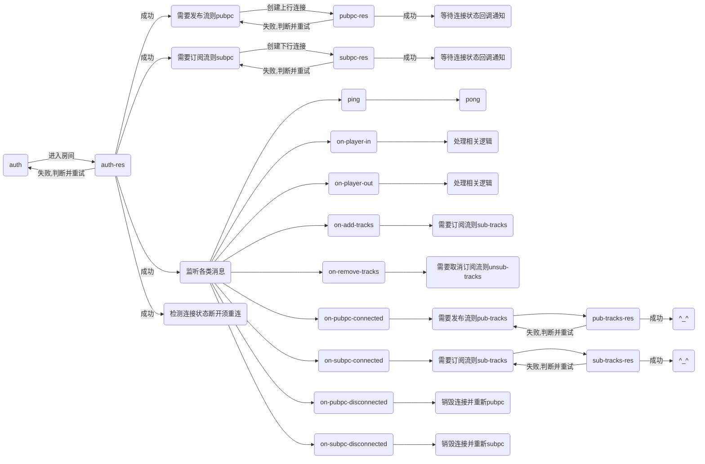

```mermaid
graph LR

A(auth) -->|进入房间| A'(auth-res)
A' -->|成功| B(需要发布流则pubpc)
A' -->|成功| C(需要订阅流则subpc)
A' -->|成功| A''(监听各类消息)
A' -->|成功| A'''(检测连接状态断开须重连)
A' -->|失败,判断并重试| A

B -->|创建上行连接| B'(pubpc-res)
B' -->|成功| D(等待连接状态回调通知)
B' -->|失败,判断并重试| B

C -->|创建下行连接| C'(subpc-res)
C' -->|成功| E(等待连接状态回调通知)
C' -->|失败,判断并重试| C

A'' --> x1(ping)
A'' --> x2(on-player-in)
A'' --> x3(on-player-out)
A'' --> x4(on-add-tracks)
A'' --> x5(on-remove-tracks)
A'' --> x6(on-pubpc-connected)
A'' --> x7(on-subpc-connected)
A'' --> x8(on-pubpc-disconnected)
A'' --> x9(on-subpc-disconnected)

x1 --> y1(pong)
x2 --> y2(处理相关逻辑)
x3 --> y3(处理相关逻辑)
x4 --> y4(需要订阅流则sub-tracks)
x5 --> y5(需要取消订阅流则unsub-tracks)
x6 --> y6(需要发布流则pub-tracks)
x7 --> y7(需要订阅流则sub-tracks)
x8 --> y8(销毁连接并重新pubpc)
x9 --> y9(销毁连接并重新subpc)

y6 --> z6(pub-tracks-res)
y7 --> z7(sub-tracks-res)

z6 -->|成功| z6'(^_^)
z6 -->|失败,判断并重试| y6

z7 -->|成功| z7'(^_^)
z7 -->|失败,判断并重试| y7


```
